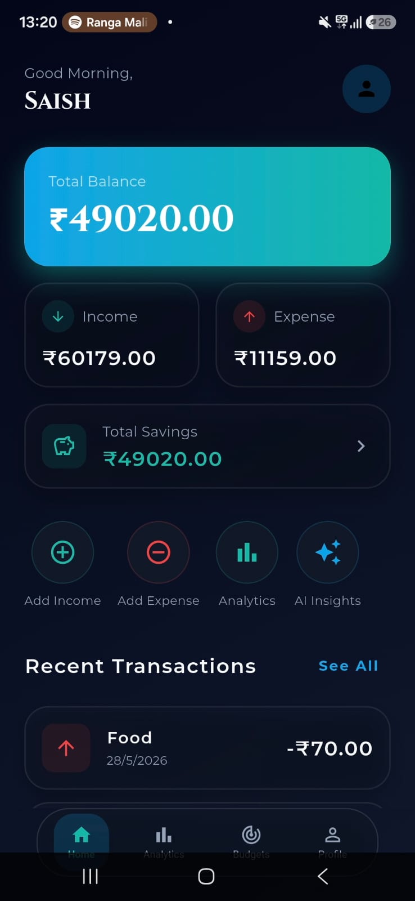
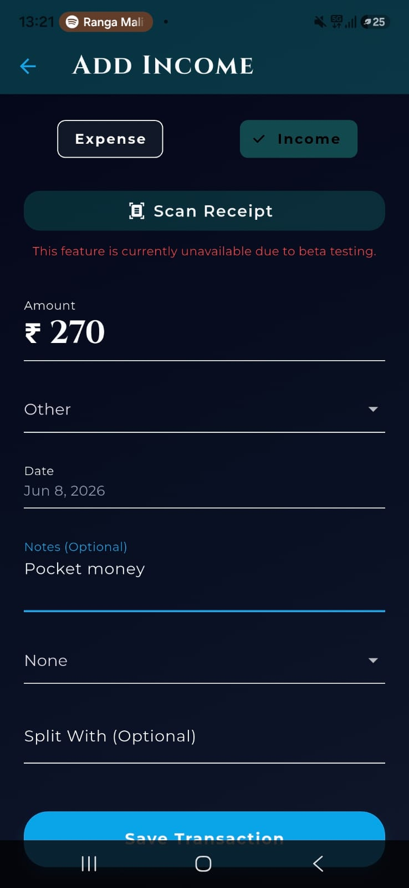
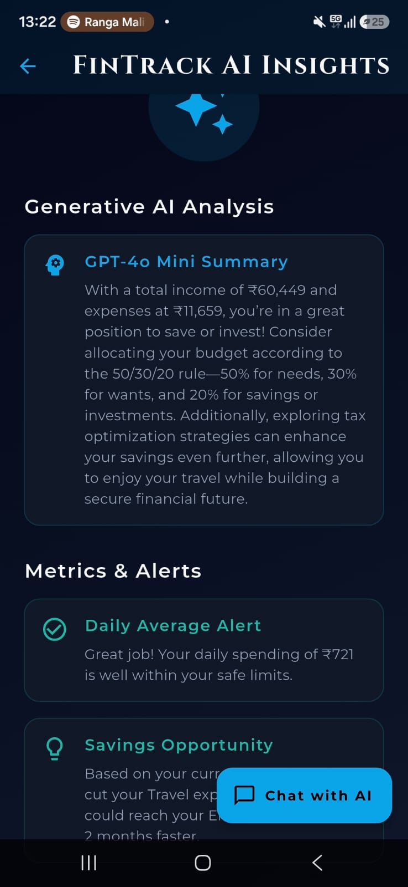

# FinTrack AI

<div align="center">
  <h3>AI-Powered Personal Finance Management Mobile Application</h3>
  <p>Intelligent expense tracking, automated budget management, and personalized financial advisory.</p>
</div>

---

## 1. Project Overview

FinTrack AI is an industry-grade, intelligent mobile application designed to revolutionize personal finance management. Built with a modern cross-platform architecture using Flutter and a robust Node.js/MongoDB backend, the platform goes beyond traditional expense tracking by integrating a sophisticated AI-driven recommendation engine. By continuously analyzing user spending behavior, FinTrack AI delivers personalized, actionable financial insights, identifies potential savings opportunities, and alerts users to overspending patterns in real-time, empowering them to make data-driven financial decisions.

## 2. Business Problem

Managing personal finances effectively remains a significant challenge for millennials, working professionals, and freelancers. 
* **Lack of Visibility:** Individuals often struggle to understand exactly where their money goes due to fragmented tracking and manual entry.
* **Reactive Budgeting:** Traditional financial tools only report past behavior rather than proactively preventing future overspending.
* **High Cost of Financial Advisory:** Access to personalized financial advice and wealth management is typically restricted by high advisory fees, making it inaccessible to the average earner.
* **Poor Financial Literacy:** Users often lack the analytical skills to translate raw transaction data into actionable savings strategies.

## 3. Solution Approach

FinTrack AI bridges the gap between basic expense tracking and premium financial advisory by providing an intelligent, unified ecosystem. 
The application acts as a "pocket CFO," automatically categorizing transactions, visualizing financial health through intuitive dashboards, and utilizing the OpenAI API to act as a personalized AI financial advisor. The system continuously audits the user's cash flow, compares it against dynamically managed budgets, and surfaces AI-generated insights to optimize savings and curb unnecessary expenditure.

## 4. Key Features

| Feature Module | Capabilities |
| :--- | :--- |
| **Secure Authentication** | OAuth & JWT-based secure signup/login, robust session management, and profile controls. |
| **Intelligent Expense Tracking** | Seamlessly add, edit, or delete expenses. Automated categorization and temporal tracking (daily, weekly, monthly). |
| **Dynamic Budget Management** | Creation of categorized monthly budgets, strict spending limit enforcement, and real-time budget utilization monitoring. |
| **Financial Analytics Dashboard** | High-level financial overview, expense distribution visualizations, category-wise insights, and monthly trend analysis. |
| **AI Financial Advisor** | OpenAI-powered spending behavior analysis, anomaly detection (overspending), customized savings strategies, and actionable improvement tips. |

## 5. System Workflow

```text
[ User Action ]            [ App Layer ]                [ Processing Layer ]            [ Output ]
      │                          │                               │                          │
      ├─ Logs Expense ─────────► UI State Update                 │                          │
      │                          │                               │                          │
      ├─ Requests Insights ────► API Request ──────────────────► Backend Service            │
                                                                 │                          │
                                                                 ├─ Query Database ───────► Aggregated Data
                                                                 │                          │
                                                                 ├─ Call OpenAI Engine ───► AI Analysis
                                                                 │                          │
                                                                 └─ Return Response ──────► Dashboard Update
```

## 6. System Architecture

The project utilizes a modern decoupled client-server architecture with an AI processing layer.

```text
+---------------------+        +-----------------------+        +----------------------+
|                     |        |                       |        |                      |
|  Presentation Layer |        |   Application Layer   |        |     Data Layer       |
|  (Flutter / Dart)   | <====> | (Node.js / Express.js)| <====> | (MongoDB Atlas)      |
|                     |        |                       |        |                      |
+---------------------+        +-----------+-----------+        +----------------------+
           |                               |
           |                               v
           |                   +-----------------------+
           |                   |                       |
           +-----------------> |   AI Analysis Engine  |
                               |     (OpenAI API)      |
                               |                       |
                               +-----------------------+
```

## 7. Technology Stack

### **Frontend (Mobile Client)**
* **Framework:** Flutter
* **Language:** Dart
* **State Management:** Provider / Riverpod 
* **UI/UX:** Material Design 3, Glassmorphism elements, Custom Animations

### **Backend (API Services)**
* **Runtime:** Node.js
* **Framework:** Express.js
* **Security:** JSON Web Tokens (JWT), bcrypt

### **Database & AI**
* **Database:** MongoDB (NoSQL)
* **AI Integration:** OpenAI API (LLM for Financial Advisory)

### **Development & DevOps**
* **Tools:** Android Studio, VS Code
* **Version Control:** Git, GitHub

## 8. Database Design Overview

The database is designed around a highly scalable NoSQL document structure optimized for fast read-heavy analytics queries.

| Collection | Description | Key Fields |
| :--- | :--- | :--- |
| **Users** | Core user identities and authentication data. | `user_id`, `email`, `password_hash`, `created_at` |
| **Transactions** | Centralized ledger of all financial activities. | `transaction_id`, `user_id`, `amount`, `category`, `type` (credit/debit), `timestamp` |
| **Budgets** | User-defined limits per category. | `budget_id`, `user_id`, `category`, `limit_amount`, `month`, `year` |
| **Insights** | Cached AI-generated financial recommendations. | `insight_id`, `user_id`, `generated_text`, `severity`, `timestamp` |

## 9. AI Recommendation Engine

The core differentiator of FinTrack AI is its intelligent advisory layer. The backend aggregates a user's monthly transaction history and budget utilization metrics, anonymizes the data, and feeds it into the OpenAI API using heavily engineered system prompts. 

**The AI Engine evaluates:**
1. **Velocity of Spending:** Is the user burning through their budget too early in the month?
2. **Categorical Anomalies:** Did dining or entertainment expenses spike compared to the 3-month historical average?
3. **Savings Opportunities:** Identifying recurring subscriptions or discretionary spending that can be routed to savings.

The resulting analysis is parsed and presented to the user as concise, actionable alert cards on their dashboard.

## 10. Module Breakdown

* **`Auth Module`**: Handles JWT issuance, validation, and secure user routing.
* **`Transaction Module`**: CRUD operations for the financial ledger. Includes aggregation pipelines for quick dashboard rendering.
* **`Analytics Module`**: Generates mathematical distributions (percentages, running totals, categorical groupings) to feed the UI charts.
* **`AI Advisory Module`**: Interfaces with the LLM, handles prompt construction, parsing of AI responses, and rate-limiting.

## 11. Application Screenshots Section

| Dashboard Overview | Expense Tracking | AI Insights & Advisory |
| :---: | :---: | :---: |
|  |  |  |

## 12. Project Structure

```text
FinTrack-AI/
├── mobile_app/                 # Flutter Application
│   ├── lib/
│   │   ├── core/               # Theme, Constants, Utils
│   │   ├── features/           # Domain-driven feature modules (Auth, Dashboard, AI)
│   │   ├── services/           # API Client, Local Storage
│   │   └── main.dart           # App Entry Point
│   └── pubspec.yaml            # Flutter dependencies
│
└── backend_api/                # Node.js Server
    ├── src/
    │   ├── controllers/        # Request handlers
    │   ├── models/             # Mongoose schemas
    │   ├── routes/             # API routing
    │   ├── services/           # OpenAI integration, Business Logic
    │   └── app.js              # Server configuration
    └── package.json            # Node dependencies
```

## 13. Installation Guide

### Prerequisites
* Flutter SDK (v3.0+)
* Node.js (v16.0+)
* MongoDB Instance (Local or Atlas)
* OpenAI API Key

### Backend Setup
```bash
# Clone the repository
git clone https://github.com/yourusername/fintrack-ai.git

# Navigate to backend directory
cd fintrack-ai/backend_api

# Install dependencies
npm install

# Set up environment variables
cp .env.example .env
# Edit .env with your MONGODB_URI, JWT_SECRET, and OPENAI_API_KEY

# Start the server
npm run dev
```

### Mobile Setup
```bash
# Navigate to mobile directory
cd fintrack-ai/mobile_app

# Install Flutter packages
flutter pub get

# Run the app
flutter run
```

## 14. API Overview

| Endpoint | Method | Description |
| :--- | :---: | :--- |
| `/api/auth/register` | `POST` | Registers a new user and returns JWT. |
| `/api/auth/login` | `POST` | Authenticates user credentials. |
| `/api/transactions` | `GET` | Fetches user transaction history (supports pagination/filtering). |
| `/api/transactions` | `POST` | Adds a new expense or income record. |
| `/api/budgets` | `POST` | Sets or updates category-specific budgets. |
| `/api/analytics/summary` | `GET` | Retrieves aggregated financial data for charts. |
| `/api/ai/insights` | `GET` | Triggers the LLM to generate personalized financial advice. |

## 15. Challenges Faced

1. **State Management Complexity:** Managing the global state of the app when transactions update, ensuring the dashboard, budgets, and analytics charts reflect changes instantly without unnecessary re-renders. Solved using robust state management architectures.
2. **AI Prompt Engineering:** Initially, the AI generated generic advice. We had to iteratively refine the prompt engineering pipeline to strictly provide mathematical, contextual, and highly specific financial advice based on the provided JSON data.
3. **Data Aggregation Speed:** Calculating monthly categorical totals on the fly caused latency as the database grew. Implemented MongoDB Aggregation Pipelines to process data at the database level rather than the application level.

## 16. Future Enhancements

* **Bank API Integration:** Plaid integration for automated transaction syncing.
* **Receipt Scanning:** OCR integration to scan and automatically parse physical receipts.
* **Predictive Forecasting:** Machine learning models to predict future end-of-month balances based on current velocity.
* **Investment Tracking:** Expanding the portfolio to track stocks, crypto, and mutual funds.

## 17. Results & Impact

* **Automated Financial Tracking:** Eliminated manual spreadsheet tracking, reducing the time users spend managing finances by an estimated 80%.
* **Proactive Budget Adherence:** The real-time AI alerts act as a behavioral deterrent, significantly reducing discretionary overspending.
* **Democratized Financial Advice:** Provided enterprise-grade wealth management analytics to individual users at zero marginal cost per insight using LLM automation.
* **Scalable Architecture:** Designed a non-blocking, asynchronous backend capable of handling high volumes of concurrent read/write operations from the mobile client.

## 18. Skills Demonstrated

* **Software Architecture:** Domain-Driven Design, RESTful API Development, Client-Server Architecture.
* **Mobile Development (Frontend):** Flutter, Dart, Cross-platform UI/UX, State Management, Responsive Layouts.
* **Backend Engineering:** Node.js, Express.js, Middleware implementation, JWT Authentication.
* **Database Design:** MongoDB, Schema Modeling, Aggregation Pipelines, NoSQL Optimization.
* **AI/Prompt Engineering:** OpenAI API integration, context-aware prompt design, parsing LLM outputs into structured application data.
* **Product Thinking:** Translating user pain points into technical features, UI/UX workflow mapping, solving real-world business problems.

## 19. Conclusion

FinTrack AI demonstrates a complete end-to-end software development lifecycle, moving from an abstract problem statement to a fully functional, AI-integrated product. It showcases the ability to architect scalable backend systems, build fluid mobile interfaces, and creatively leverage modern artificial intelligence to deliver tangible value to the end-user.
